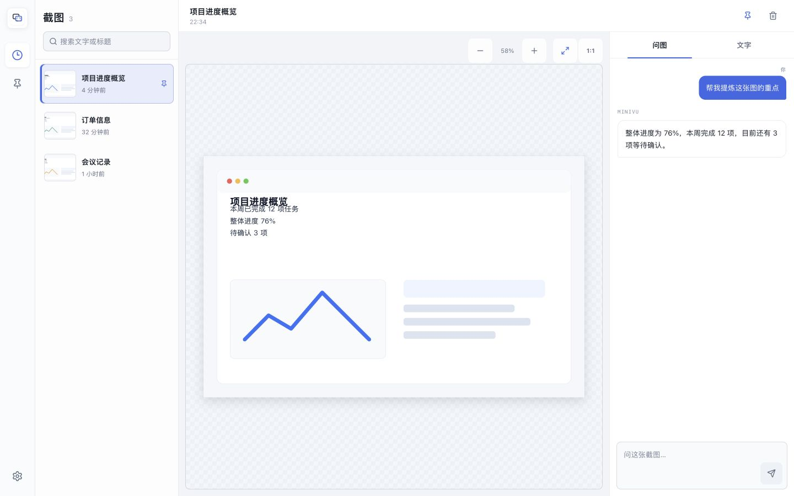

# MiniVu

[简体中文](README.md) | **English**

> A local-first screenshot workbench for macOS. Capture the screen, recognize text, organize useful shots, and ask questions about an image.

[Download MiniVu v1.0.0 for Apple Silicon](https://github.com/xavix-bit/MiniVu/releases/download/v1.0.0/MiniVu_1.0.0_aarch64.dmg)

Open the DMG and drag MiniVu into Applications. On first launch, Control-click MiniVu, choose **Open**, then confirm once. macOS 13 or later is recommended.



## Start With A Screenshot

1. Open MiniVu and choose **开始截图**. macOS may ask for screen-recording permission the first time.
2. Frame any part of the screen. MiniVu saves the screenshot to the workbench and recognizes its text automatically.
3. Copy the recognized text or ask a question about the image.
4. If no image model is installed, the first question takes you to the model page. After installation, MiniVu returns to the same screenshot and keeps the question you typed.

When the main window is closed, MiniVu can keep a small floating launcher on screen. Expand it to capture, paste an image, or open recent items. The global shortcut can also start a capture from any app.

## Workbench

- Search recent screenshots or pin the ones you want to keep.
- Zoom, fit, view at 1:1, and drag large screenshots around the canvas.
- Switch between recognized text and image questions without losing the current draft.
- Compare exact model names, download sizes, and memory estimates before installing one for your Mac.
- Keep screenshots for 24 hours by default, or choose no history, 7 days, or permanent retention. Pinned screenshots do not expire.

## Privacy

- Screenshots, recognized text, prompts, and answers stay on this Mac.
- Capture records live in the application data directory and are cleaned according to the selected retention period.
- MiniVu accesses the network only when you download or update a model, install an optional component, or test a download source.
- Images are not sent to a cloud inference service. MiniVu has no account or sync feature.

See the [local-first policy](docs/privacy/local-first-policy.md) for details.

## Development

```bash
npm install
npm run tauri dev
```

Useful checks:

```bash
npm test
npm run build
cargo test --manifest-path src-tauri/Cargo.toml
npm run tauri build -- --debug
```

## Important Paths

- Workbench: `src/workbench/`
- Capture library: `src/captures/`
- Floating panel: `src/app-shell/QuickPanelShell.tsx`
- Local capture store: `src-tauri/src/capture_store.rs`
- macOS region capture: `src-tauri/src/screenshot.rs`
- Text recognition and sessions: `src/chat/useImageSession.ts`
- Model client: `src/model/modelClient.ts`
- Image-question workflow: `src-tauri/src/inference/`
- Local service lifecycle: `src-tauri/src/sidecar/`

## Current Version

MiniVu v1.0.0 targets Apple Silicon Macs. It includes screenshot history, text recognition, per-image conversations, a draggable floating launcher, pinning, and search. It does not currently include accounts, sync, cloud processing, screenshot annotation, or multi-image comparison.
